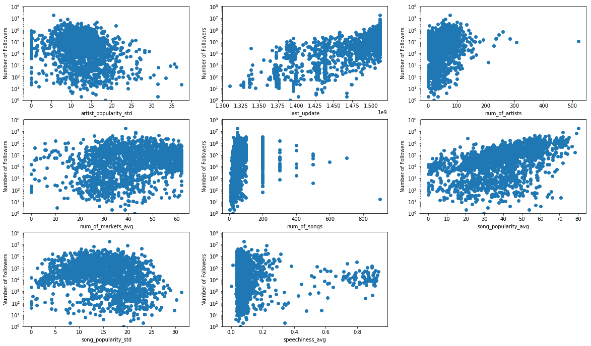

## Contents
{:.no_toc}
*  
{: toc}


```python
import numpy as np
import pandas as pd
import matplotlib.pyplot as plt
from sklearn.preprocessing import MinMaxScaler
import statsmodels.api as sm
from sklearn.model_selection import train_test_split
from sklearn.linear_model import RidgeCV
from sklearn.linear_model import LassoCV

%matplotlib inline
```


```python
data = pd.read_csv('data_spotify_v2.csv', index_col= 0)
```


```python
data.shape
```


    (1669, 42)


```python
data.dropna(how='any', inplace= True)
```


```python
data.drop(['is_collaborative', 'is_public'], axis =1 , inplace= True)
```


```python
data1 = data.copy()
X = data1.drop(['followers'], axis = 1)
```


```python
scaler = MinMaxScaler().fit(X)

data1 = scaler.transform(X)

data1 = pd.DataFrame(data1, columns= X.columns)

data1['followers'] = data['followers']


```


```python
data3 = data1.copy()
```


```python

data3['followers'] = np.log10(1 + data3['followers'])
```


```python
y = (data1['followers'])

X = data1.drop(['followers'], axis = 1)
```


```python
X = sm.add_constant(X)
model = sm.OLS(y,X)
results = model.fit()
results.summary()
```


<table class="simpletable">
<caption>OLS Regression Results</caption>
<tr>
  <th>Dep. Variable:</th>        <td>followers</td>    <th>  R-squared:         </th> <td>   0.175</td> 
</tr>
<tr>
  <th>Model:</th>                   <td>OLS</td>       <th>  Adj. R-squared:    </th> <td>   0.156</td> 
</tr>
<tr>
  <th>Method:</th>             <td>Least Squares</td>  <th>  F-statistic:       </th> <td>   8.876</td> 
</tr>
<tr>
  <th>Date:</th>             <td>Sun, 03 Dec 2017</td> <th>  Prob (F-statistic):</th> <td>2.52e-45</td> 
</tr>
<tr>
  <th>Time:</th>                 <td>23:55:15</td>     <th>  Log-Likelihood:    </th> <td> -24607.</td> 
</tr>
<tr>
  <th>No. Observations:</th>      <td>  1669</td>      <th>  AIC:               </th> <td>4.929e+04</td>
</tr>
<tr>
  <th>Df Residuals:</th>          <td>  1629</td>      <th>  BIC:               </th> <td>4.951e+04</td>
</tr>
<tr>
  <th>Df Model:</th>              <td>    39</td>      <th>                     </th>     <td> </td>    
</tr>
<tr>
  <th>Covariance Type:</th>      <td>nonrobust</td>    <th>                     </th>     <td> </td>    
</tr>
</table>
<table class="simpletable">
<tr>
            <td></td>               <th>coef</th>     <th>std err</th>      <th>t</th>      <th>P>|t|</th>  <th>[0.025</th>    <th>0.975]</th>  
</tr>
<tr>
  <th>const</th>                 <td>-9.063e+05</td> <td> 5.17e+05</td> <td>   -1.755</td> <td> 0.080</td> <td>-1.92e+06</td> <td> 1.07e+05</td>
</tr>
<tr>
  <th>acousticness_avg</th>      <td>  1.34e+05</td> <td> 1.94e+05</td> <td>    0.691</td> <td> 0.490</td> <td>-2.46e+05</td> <td> 5.14e+05</td>
</tr>
<tr>
  <th>acousticness_std</th>      <td> 1.066e+04</td> <td> 1.45e+05</td> <td>    0.074</td> <td> 0.941</td> <td>-2.74e+05</td> <td> 2.95e+05</td>
</tr>
<tr>
  <th>artist_genres</th>         <td>-7.221e+04</td> <td> 1.68e+05</td> <td>   -0.429</td> <td> 0.668</td> <td>-4.02e+05</td> <td> 2.58e+05</td>
</tr>
<tr>
  <th>artist_popularity_avg</th> <td>-1.111e+05</td> <td> 2.08e+05</td> <td>   -0.534</td> <td> 0.593</td> <td>-5.19e+05</td> <td> 2.97e+05</td>
</tr>
<tr>
  <th>artist_popularity_std</th> <td> 2.552e+04</td> <td> 1.55e+05</td> <td>    0.165</td> <td> 0.869</td> <td>-2.78e+05</td> <td> 3.29e+05</td>
</tr>
<tr>
  <th>danceability_avg</th>      <td> 4.628e+05</td> <td> 2.52e+05</td> <td>    1.840</td> <td> 0.066</td> <td>-3.06e+04</td> <td> 9.56e+05</td>
</tr>
<tr>
  <th>danceability_std</th>      <td> 3.333e+04</td> <td> 2.31e+05</td> <td>    0.144</td> <td> 0.885</td> <td>-4.19e+05</td> <td> 4.86e+05</td>
</tr>
<tr>
  <th>duration_ms_avg</th>       <td>-3.195e+06</td> <td>  6.6e+06</td> <td>   -0.484</td> <td> 0.628</td> <td>-1.61e+07</td> <td> 9.75e+06</td>
</tr>
<tr>
  <th>duration_ms_std</th>       <td> 1.018e+06</td> <td> 1.41e+06</td> <td>    0.722</td> <td> 0.471</td> <td>-1.75e+06</td> <td> 3.78e+06</td>
</tr>
<tr>
  <th>energy_avg</th>            <td> 9.931e+04</td> <td>  3.5e+05</td> <td>    0.284</td> <td> 0.777</td> <td>-5.87e+05</td> <td> 7.86e+05</td>
</tr>
<tr>
  <th>energy_std</th>            <td> 1.228e+04</td> <td> 2.27e+05</td> <td>    0.054</td> <td> 0.957</td> <td>-4.32e+05</td> <td> 4.57e+05</td>
</tr>
<tr>
  <th>first_update</th>          <td>-1.152e+05</td> <td>    2e+05</td> <td>   -0.575</td> <td> 0.565</td> <td>-5.08e+05</td> <td> 2.78e+05</td>
</tr>
<tr>
  <th>instrumentalness_avg</th>  <td> 5.671e+04</td> <td> 1.19e+05</td> <td>    0.475</td> <td> 0.635</td> <td>-1.77e+05</td> <td> 2.91e+05</td>
</tr>
<tr>
  <th>instrumentalness_std</th>  <td>-1.692e+04</td> <td> 9.39e+04</td> <td>   -0.180</td> <td> 0.857</td> <td>-2.01e+05</td> <td> 1.67e+05</td>
</tr>
<tr>
  <th>key_avg</th>               <td>  2.17e+04</td> <td> 1.68e+05</td> <td>    0.129</td> <td> 0.897</td> <td>-3.07e+05</td> <td> 3.51e+05</td>
</tr>
<tr>
  <th>key_std</th>               <td>  9.61e+04</td> <td> 1.83e+05</td> <td>    0.524</td> <td> 0.601</td> <td>-2.64e+05</td> <td> 4.56e+05</td>
</tr>
<tr>
  <th>last_update</th>           <td> 3.044e+05</td> <td>  2.1e+05</td> <td>    1.453</td> <td> 0.146</td> <td>-1.07e+05</td> <td> 7.15e+05</td>
</tr>
<tr>
  <th>liveness_avg</th>          <td>-2.948e+05</td> <td> 2.92e+05</td> <td>   -1.010</td> <td> 0.313</td> <td>-8.67e+05</td> <td> 2.78e+05</td>
</tr>
<tr>
  <th>liveness_std</th>          <td> 8.514e+04</td> <td> 1.54e+05</td> <td>    0.554</td> <td> 0.580</td> <td>-2.16e+05</td> <td> 3.87e+05</td>
</tr>
<tr>
  <th>loudness_avg</th>          <td> 1.331e+05</td> <td>  5.8e+05</td> <td>    0.229</td> <td> 0.819</td> <td>   -1e+06</td> <td> 1.27e+06</td>
</tr>
<tr>
  <th>loudness_std</th>          <td>-1.934e+04</td> <td> 2.85e+05</td> <td>   -0.068</td> <td> 0.946</td> <td>-5.79e+05</td> <td>  5.4e+05</td>
</tr>
<tr>
  <th>mode_avg</th>              <td> 1.651e+05</td> <td> 1.62e+05</td> <td>    1.018</td> <td> 0.309</td> <td>-1.53e+05</td> <td> 4.83e+05</td>
</tr>
<tr>
  <th>mode_std</th>              <td> 1.111e+05</td> <td> 1.85e+05</td> <td>    0.602</td> <td> 0.547</td> <td>-2.51e+05</td> <td> 4.73e+05</td>
</tr>
<tr>
  <th>num_of_artists</th>        <td> 9.363e+05</td> <td> 3.25e+05</td> <td>    2.882</td> <td> 0.004</td> <td> 2.99e+05</td> <td> 1.57e+06</td>
</tr>
<tr>
  <th>num_of_markets_avg</th>    <td>-3.407e+05</td> <td> 9.91e+04</td> <td>   -3.440</td> <td> 0.001</td> <td>-5.35e+05</td> <td>-1.46e+05</td>
</tr>
<tr>
  <th>num_of_songs</th>          <td>  2.75e+05</td> <td> 2.44e+05</td> <td>    1.126</td> <td> 0.260</td> <td>-2.04e+05</td> <td> 7.54e+05</td>
</tr>
<tr>
  <th>playlist_name_length</th>  <td>-2.723e+05</td> <td> 1.69e+05</td> <td>   -1.613</td> <td> 0.107</td> <td>-6.03e+05</td> <td> 5.89e+04</td>
</tr>
<tr>
  <th>song_duration_avg</th>     <td> 2.755e+06</td> <td> 6.85e+06</td> <td>    0.402</td> <td> 0.688</td> <td>-1.07e+07</td> <td> 1.62e+07</td>
</tr>
<tr>
  <th>song_duration_std</th>     <td>-1.643e+06</td> <td> 4.18e+06</td> <td>   -0.393</td> <td> 0.694</td> <td>-9.84e+06</td> <td> 6.55e+06</td>
</tr>
<tr>
  <th>song_popularity_avg</th>   <td> 1.319e+06</td> <td> 1.68e+05</td> <td>    7.836</td> <td> 0.000</td> <td> 9.89e+05</td> <td> 1.65e+06</td>
</tr>
<tr>
  <th>song_popularity_std</th>   <td>-3.713e+05</td> <td> 1.31e+05</td> <td>   -2.834</td> <td> 0.005</td> <td>-6.28e+05</td> <td>-1.14e+05</td>
</tr>
<tr>
  <th>speechiness_avg</th>       <td>  2.45e+05</td> <td> 2.29e+05</td> <td>    1.071</td> <td> 0.284</td> <td>-2.03e+05</td> <td> 6.93e+05</td>
</tr>
<tr>
  <th>speechiness_std</th>       <td>-2.747e+04</td> <td> 1.66e+05</td> <td>   -0.166</td> <td> 0.868</td> <td>-3.53e+05</td> <td> 2.98e+05</td>
</tr>
<tr>
  <th>tempo_avg</th>             <td> 2.714e+05</td> <td> 3.97e+05</td> <td>    0.684</td> <td> 0.494</td> <td>-5.07e+05</td> <td> 1.05e+06</td>
</tr>
<tr>
  <th>tempo_std</th>             <td> 2.208e+04</td> <td> 1.97e+05</td> <td>    0.112</td> <td> 0.911</td> <td>-3.65e+05</td> <td> 4.09e+05</td>
</tr>
<tr>
  <th>time_signature_avg</th>    <td>-8.301e+04</td> <td> 5.47e+05</td> <td>   -0.152</td> <td> 0.879</td> <td>-1.16e+06</td> <td>  9.9e+05</td>
</tr>
<tr>
  <th>time_signature_std</th>    <td> 1.874e+05</td> <td> 1.82e+05</td> <td>    1.029</td> <td> 0.304</td> <td> -1.7e+05</td> <td> 5.45e+05</td>
</tr>
<tr>
  <th>valence_avg</th>           <td>-2.356e+05</td> <td> 1.72e+05</td> <td>   -1.366</td> <td> 0.172</td> <td>-5.74e+05</td> <td> 1.03e+05</td>
</tr>
<tr>
  <th>valence_std</th>           <td>-1.267e+05</td> <td> 1.69e+05</td> <td>   -0.750</td> <td> 0.453</td> <td>-4.58e+05</td> <td> 2.05e+05</td>
</tr>
</table>
<table class="simpletable">
<tr>
  <th>Omnibus:</th>       <td>3357.684</td> <th>  Durbin-Watson:     </th>   <td>   0.625</td>  
</tr>
<tr>
  <th>Prob(Omnibus):</th>  <td> 0.000</td>  <th>  Jarque-Bera (JB):  </th> <td>10717432.580</td>
</tr>
<tr>
  <th>Skew:</th>           <td>15.691</td>  <th>  Prob(JB):          </th>   <td>    0.00</td>  
</tr>
<tr>
  <th>Kurtosis:</th>       <td>394.319</td> <th>  Cond. No.          </th>   <td>2.23e+03</td>  
</tr>
</table>


*** The R-square value is very low. So next we try with the log of the number of followers ***


```python
y2 = (data3['followers'])

X2 = data3.drop(['followers'], axis = 1)
```


```python
X2.shape, y2.shape
```


    ((1669, 39), (1669,))


```python
X2 = sm.add_constant(X2)
model = sm.OLS(y2,X2)
results = model.fit()
results.summary()
```


<table class="simpletable">
<caption>OLS Regression Results</caption>
<tr>
  <th>Dep. Variable:</th>        <td>followers</td>    <th>  R-squared:         </th> <td>   0.606</td> 
</tr>
<tr>
  <th>Model:</th>                   <td>OLS</td>       <th>  Adj. R-squared:    </th> <td>   0.596</td> 
</tr>
<tr>
  <th>Method:</th>             <td>Least Squares</td>  <th>  F-statistic:       </th> <td>   64.15</td> 
</tr>
<tr>
  <th>Date:</th>             <td>Sun, 03 Dec 2017</td> <th>  Prob (F-statistic):</th> <td>2.19e-296</td>
</tr>
<tr>
  <th>Time:</th>                 <td>23:55:18</td>     <th>  Log-Likelihood:    </th> <td> -2204.3</td> 
</tr>
<tr>
  <th>No. Observations:</th>      <td>  1669</td>      <th>  AIC:               </th> <td>   4489.</td> 
</tr>
<tr>
  <th>Df Residuals:</th>          <td>  1629</td>      <th>  BIC:               </th> <td>   4705.</td> 
</tr>
<tr>
  <th>Df Model:</th>              <td>    39</td>      <th>                     </th>     <td> </td>    
</tr>
<tr>
  <th>Covariance Type:</th>      <td>nonrobust</td>    <th>                     </th>     <td> </td>    
</tr>
</table>
<table class="simpletable">
<tr>
            <td></td>               <th>coef</th>     <th>std err</th>      <th>t</th>      <th>P>|t|</th>  <th>[0.025</th>    <th>0.975]</th>  
</tr>
<tr>
  <th>const</th>                 <td>   -0.8181</td> <td>    0.765</td> <td>   -1.070</td> <td> 0.285</td> <td>   -2.318</td> <td>    0.682</td>
</tr>
<tr>
  <th>acousticness_avg</th>      <td>   -0.2280</td> <td>    0.287</td> <td>   -0.794</td> <td> 0.427</td> <td>   -0.791</td> <td>    0.335</td>
</tr>
<tr>
  <th>acousticness_std</th>      <td>    0.0998</td> <td>    0.215</td> <td>    0.465</td> <td> 0.642</td> <td>   -0.321</td> <td>    0.521</td>
</tr>
<tr>
  <th>artist_genres</th>         <td>   -0.0816</td> <td>    0.249</td> <td>   -0.328</td> <td> 0.743</td> <td>   -0.570</td> <td>    0.407</td>
</tr>
<tr>
  <th>artist_popularity_avg</th> <td>   -0.0145</td> <td>    0.308</td> <td>   -0.047</td> <td> 0.962</td> <td>   -0.618</td> <td>    0.589</td>
</tr>
<tr>
  <th>artist_popularity_std</th> <td>   -0.8244</td> <td>    0.229</td> <td>   -3.598</td> <td> 0.000</td> <td>   -1.274</td> <td>   -0.375</td>
</tr>
<tr>
  <th>danceability_avg</th>      <td>   -0.2004</td> <td>    0.372</td> <td>   -0.538</td> <td> 0.591</td> <td>   -0.931</td> <td>    0.530</td>
</tr>
<tr>
  <th>danceability_std</th>      <td>    0.8524</td> <td>    0.342</td> <td>    2.495</td> <td> 0.013</td> <td>    0.182</td> <td>    1.523</td>
</tr>
<tr>
  <th>duration_ms_avg</th>       <td>  -17.3303</td> <td>    9.774</td> <td>   -1.773</td> <td> 0.076</td> <td>  -36.502</td> <td>    1.842</td>
</tr>
<tr>
  <th>duration_ms_std</th>       <td>    3.6632</td> <td>    2.089</td> <td>    1.754</td> <td> 0.080</td> <td>   -0.434</td> <td>    7.760</td>
</tr>
<tr>
  <th>energy_avg</th>            <td>   -0.4570</td> <td>    0.518</td> <td>   -0.882</td> <td> 0.378</td> <td>   -1.474</td> <td>    0.560</td>
</tr>
<tr>
  <th>energy_std</th>            <td>   -0.8945</td> <td>    0.335</td> <td>   -2.666</td> <td> 0.008</td> <td>   -1.553</td> <td>   -0.236</td>
</tr>
<tr>
  <th>first_update</th>          <td>   -0.5201</td> <td>    0.297</td> <td>   -1.753</td> <td> 0.080</td> <td>   -1.102</td> <td>    0.062</td>
</tr>
<tr>
  <th>instrumentalness_avg</th>  <td>   -0.0427</td> <td>    0.177</td> <td>   -0.241</td> <td> 0.809</td> <td>   -0.389</td> <td>    0.304</td>
</tr>
<tr>
  <th>instrumentalness_std</th>  <td>    0.1709</td> <td>    0.139</td> <td>    1.229</td> <td> 0.219</td> <td>   -0.102</td> <td>    0.444</td>
</tr>
<tr>
  <th>key_avg</th>               <td>    0.4959</td> <td>    0.248</td> <td>    1.996</td> <td> 0.046</td> <td>    0.009</td> <td>    0.983</td>
</tr>
<tr>
  <th>key_std</th>               <td>   -0.0764</td> <td>    0.272</td> <td>   -0.281</td> <td> 0.779</td> <td>   -0.609</td> <td>    0.457</td>
</tr>
<tr>
  <th>last_update</th>           <td>    3.7703</td> <td>    0.310</td> <td>   12.153</td> <td> 0.000</td> <td>    3.162</td> <td>    4.379</td>
</tr>
<tr>
  <th>liveness_avg</th>          <td>    0.4379</td> <td>    0.432</td> <td>    1.013</td> <td> 0.311</td> <td>   -0.410</td> <td>    1.286</td>
</tr>
<tr>
  <th>liveness_std</th>          <td>   -0.4434</td> <td>    0.228</td> <td>   -1.948</td> <td> 0.052</td> <td>   -0.890</td> <td>    0.003</td>
</tr>
<tr>
  <th>loudness_avg</th>          <td>    0.2828</td> <td>    0.859</td> <td>    0.329</td> <td> 0.742</td> <td>   -1.402</td> <td>    1.967</td>
</tr>
<tr>
  <th>loudness_std</th>          <td>    0.7059</td> <td>    0.422</td> <td>    1.672</td> <td> 0.095</td> <td>   -0.122</td> <td>    1.534</td>
</tr>
<tr>
  <th>mode_avg</th>              <td>    0.5481</td> <td>    0.240</td> <td>    2.282</td> <td> 0.023</td> <td>    0.077</td> <td>    1.019</td>
</tr>
<tr>
  <th>mode_std</th>              <td>    0.5063</td> <td>    0.273</td> <td>    1.852</td> <td> 0.064</td> <td>   -0.030</td> <td>    1.042</td>
</tr>
<tr>
  <th>num_of_artists</th>        <td>    1.8421</td> <td>    0.481</td> <td>    3.830</td> <td> 0.000</td> <td>    0.899</td> <td>    2.785</td>
</tr>
<tr>
  <th>num_of_markets_avg</th>    <td>   -0.5208</td> <td>    0.147</td> <td>   -3.551</td> <td> 0.000</td> <td>   -0.809</td> <td>   -0.233</td>
</tr>
<tr>
  <th>num_of_songs</th>          <td>    1.9212</td> <td>    0.362</td> <td>    5.312</td> <td> 0.000</td> <td>    1.212</td> <td>    2.631</td>
</tr>
<tr>
  <th>playlist_name_length</th>  <td>   -0.2951</td> <td>    0.250</td> <td>   -1.180</td> <td> 0.238</td> <td>   -0.785</td> <td>    0.195</td>
</tr>
<tr>
  <th>song_duration_avg</th>     <td>   20.1445</td> <td>   10.148</td> <td>    1.985</td> <td> 0.047</td> <td>    0.240</td> <td>   40.049</td>
</tr>
<tr>
  <th>song_duration_std</th>     <td>  -13.8858</td> <td>    6.188</td> <td>   -2.244</td> <td> 0.025</td> <td>  -26.023</td> <td>   -1.749</td>
</tr>
<tr>
  <th>song_popularity_avg</th>   <td>    1.9175</td> <td>    0.249</td> <td>    7.694</td> <td> 0.000</td> <td>    1.429</td> <td>    2.406</td>
</tr>
<tr>
  <th>song_popularity_std</th>   <td>   -0.9189</td> <td>    0.194</td> <td>   -4.736</td> <td> 0.000</td> <td>   -1.299</td> <td>   -0.538</td>
</tr>
<tr>
  <th>speechiness_avg</th>       <td>    1.1074</td> <td>    0.339</td> <td>    3.271</td> <td> 0.001</td> <td>    0.443</td> <td>    1.771</td>
</tr>
<tr>
  <th>speechiness_std</th>       <td>   -0.1651</td> <td>    0.245</td> <td>   -0.673</td> <td> 0.501</td> <td>   -0.647</td> <td>    0.316</td>
</tr>
<tr>
  <th>tempo_avg</th>             <td>    0.3987</td> <td>    0.588</td> <td>    0.678</td> <td> 0.498</td> <td>   -0.754</td> <td>    1.551</td>
</tr>
<tr>
  <th>tempo_std</th>             <td>    0.0067</td> <td>    0.292</td> <td>    0.023</td> <td> 0.982</td> <td>   -0.566</td> <td>    0.579</td>
</tr>
<tr>
  <th>time_signature_avg</th>    <td>    0.7050</td> <td>    0.810</td> <td>    0.870</td> <td> 0.384</td> <td>   -0.884</td> <td>    2.295</td>
</tr>
<tr>
  <th>time_signature_std</th>    <td>    0.0945</td> <td>    0.270</td> <td>    0.350</td> <td> 0.726</td> <td>   -0.435</td> <td>    0.623</td>
</tr>
<tr>
  <th>valence_avg</th>           <td>    0.5990</td> <td>    0.255</td> <td>    2.346</td> <td> 0.019</td> <td>    0.098</td> <td>    1.100</td>
</tr>
<tr>
  <th>valence_std</th>           <td>   -0.2422</td> <td>    0.250</td> <td>   -0.968</td> <td> 0.333</td> <td>   -0.733</td> <td>    0.248</td>
</tr>
</table>
<table class="simpletable">
<tr>
  <th>Omnibus:</th>       <td>525.043</td> <th>  Durbin-Watson:     </th> <td>   1.450</td>
</tr>
<tr>
  <th>Prob(Omnibus):</th> <td> 0.000</td>  <th>  Jarque-Bera (JB):  </th> <td>2564.617</td>
</tr>
<tr>
  <th>Skew:</th>          <td>-1.406</td>  <th>  Prob(JB):          </th> <td>    0.00</td>
</tr>
<tr>
  <th>Kurtosis:</th>      <td> 8.383</td>  <th>  Cond. No.          </th> <td>2.23e+03</td>
</tr>
</table>


*** Model selection ***


```python
relevant = results.pvalues[results.pvalues < 0.05]

relevant
```


    artist_popularity_std    3.307456e-04
    danceability_std         1.270408e-02
    energy_std               7.747222e-03
    key_avg                  4.611805e-02
    last_update              1.356519e-32
    mode_avg                 2.261584e-02
    num_of_artists           1.329988e-04
    num_of_markets_avg       3.950970e-04
    num_of_songs             1.232451e-07
    song_duration_avg        4.730706e-02
    song_duration_std        2.496580e-02
    song_popularity_avg      2.448120e-14
    song_popularity_std      2.369754e-06
    speechiness_avg          1.095569e-03
    valence_avg              1.907746e-02
    dtype: float64


```python
len(relevant)
```


    15


# The variables seen here with P< 0.5 are the relevant variables. Even though the R square value is still in the range of 0.21 it is much better than the case where a log value of the number of followers was not considered


```python
plt.figure(figsize=(20,20))

i=1

for r in relevant.index:
    
    plt.subplot(5,3,i)
    plt.scatter(data[r], data['followers'])
    plt.yscale('log')
    plt.ylim(ymin=1)
    plt.xlabel(r)
    plt.ylabel('Number of Followers')
        
    i += 1
    
    
    
    
```





# Baseline model


```python
X3 = data3[relevant.index]
y3 = data3['followers']
```


```python
 X_train, X_test, y_train, y_test = train_test_split(X3, y3, test_size=0.33, random_state=42)
```


```python
alpha = [10**i for i in range(-5,5)]
```


```python
ridge = RidgeCV(alphas=alpha, cv=5).fit(X_train,y_train)
lasso = LassoCV(alphas=alpha, cv=5).fit(X_train,y_train)
```


```python
ridge.alpha_, lasso.alpha_
```


    (1e-05, 1.0000000000000001e-05)


```python
ridge.score(X_train,y_train)
```


    0.59010162480135064


```python
ridge.score(X_test,y_test)
```


    0.60503546463629698


# Our baseline for test R-squared is 0.605. We need more complex models to try and improve this
