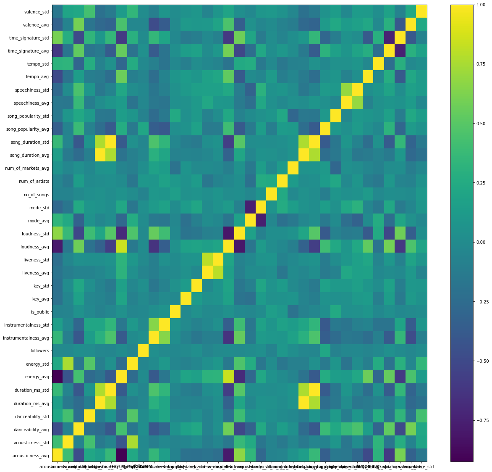
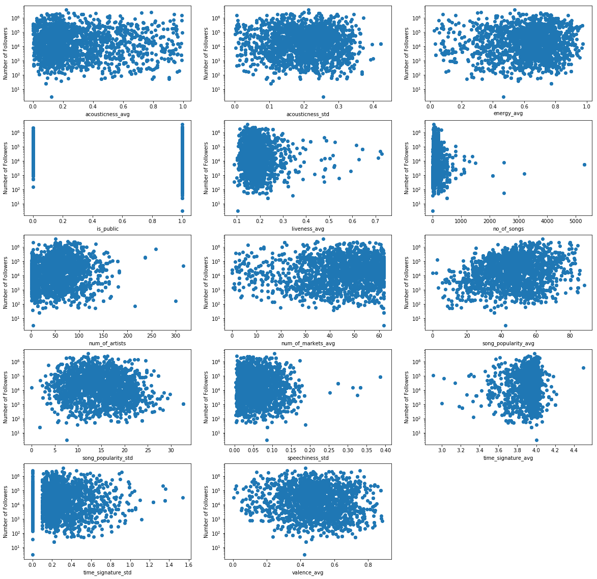

## Contents
{:.no_toc}
*  
{: toc}


```python
import numpy as np
import pandas as pd
import matplotlib.pyplot as plt
from sklearn.preprocessing import MinMaxScaler
import statsmodels.api as sm

%matplotlib inline
```


```python
data = pd.read_csv('data.csv', index_col= 0)
```


```python
data.head()
```


<div>
<style>
    .dataframe thead tr:only-child th {
        text-align: right;
    }

    .dataframe thead th {
        text-align: left;
    }

    .dataframe tbody tr th {
        vertical-align: top;
    }
</style>
<table border="1" class="dataframe">
  <thead>
    <tr style="text-align: right;">
      <th></th>
      <th>acousticness_avg</th>
      <th>acousticness_std</th>
      <th>danceability_avg</th>
      <th>danceability_std</th>
      <th>duration_ms_avg</th>
      <th>duration_ms_std</th>
      <th>energy_avg</th>
      <th>energy_std</th>
      <th>followers</th>
      <th>instrumentalness_avg</th>
      <th>...</th>
      <th>song_popularity_avg</th>
      <th>song_popularity_std</th>
      <th>speechiness_avg</th>
      <th>speechiness_std</th>
      <th>tempo_avg</th>
      <th>tempo_std</th>
      <th>time_signature_avg</th>
      <th>time_signature_std</th>
      <th>valence_avg</th>
      <th>valence_std</th>
    </tr>
  </thead>
  <tbody>
    <tr>
      <th>0</th>
      <td>0.194584</td>
      <td>0.171983</td>
      <td>0.655940</td>
      <td>0.113601</td>
      <td>203916.7400</td>
      <td>20848.451678</td>
      <td>0.655220</td>
      <td>0.140195</td>
      <td>1403307</td>
      <td>0.000076</td>
      <td>...</td>
      <td>80.5000</td>
      <td>12.147839</td>
      <td>0.081500</td>
      <td>0.067375</td>
      <td>111.175180</td>
      <td>25.315509</td>
      <td>4.0000</td>
      <td>0.200000</td>
      <td>0.422914</td>
      <td>0.165588</td>
    </tr>
    <tr>
      <th>1</th>
      <td>0.236093</td>
      <td>0.212474</td>
      <td>0.641660</td>
      <td>0.114543</td>
      <td>217370.1500</td>
      <td>50370.220381</td>
      <td>0.705670</td>
      <td>0.175782</td>
      <td>2406903</td>
      <td>0.010640</td>
      <td>...</td>
      <td>61.8900</td>
      <td>15.681770</td>
      <td>0.054565</td>
      <td>0.039034</td>
      <td>117.533380</td>
      <td>21.954430</td>
      <td>4.0000</td>
      <td>0.000000</td>
      <td>0.751000</td>
      <td>0.199712</td>
    </tr>
    <tr>
      <th>2</th>
      <td>0.185966</td>
      <td>0.173107</td>
      <td>0.656162</td>
      <td>0.114090</td>
      <td>214918.4375</td>
      <td>34896.851495</td>
      <td>0.664425</td>
      <td>0.148360</td>
      <td>218518</td>
      <td>0.004704</td>
      <td>...</td>
      <td>64.3750</td>
      <td>13.414894</td>
      <td>0.046010</td>
      <td>0.022244</td>
      <td>114.561925</td>
      <td>21.994968</td>
      <td>3.9875</td>
      <td>0.193245</td>
      <td>0.617387</td>
      <td>0.211768</td>
    </tr>
    <tr>
      <th>3</th>
      <td>0.132846</td>
      <td>0.117976</td>
      <td>0.730612</td>
      <td>0.081441</td>
      <td>209974.0000</td>
      <td>28768.262698</td>
      <td>0.758163</td>
      <td>0.113106</td>
      <td>169453</td>
      <td>0.003579</td>
      <td>...</td>
      <td>78.2875</td>
      <td>11.201779</td>
      <td>0.085573</td>
      <td>0.053110</td>
      <td>118.060038</td>
      <td>29.990054</td>
      <td>4.0000</td>
      <td>0.000000</td>
      <td>0.606237</td>
      <td>0.201211</td>
    </tr>
    <tr>
      <th>4</th>
      <td>0.032074</td>
      <td>0.083080</td>
      <td>0.487220</td>
      <td>0.126472</td>
      <td>206852.6000</td>
      <td>31874.021837</td>
      <td>0.803940</td>
      <td>0.123784</td>
      <td>473852</td>
      <td>0.030798</td>
      <td>...</td>
      <td>55.6000</td>
      <td>15.390906</td>
      <td>0.071556</td>
      <td>0.047209</td>
      <td>127.606140</td>
      <td>29.084261</td>
      <td>3.9200</td>
      <td>0.440000</td>
      <td>0.557880</td>
      <td>0.193230</td>
    </tr>
  </tbody>
</table>
<p>5 rows × 35 columns</p>
</div>


```python
data.columns
```


    Index(['acousticness_avg', 'acousticness_std', 'danceability_avg',
           'danceability_std', 'duration_ms_avg', 'duration_ms_std', 'energy_avg',
           'energy_std', 'followers', 'instrumentalness_avg',
           'instrumentalness_std', 'is_public', 'key_avg', 'key_std',
           'liveness_avg', 'liveness_std', 'loudness_avg', 'loudness_std',
           'mode_avg', 'mode_std', 'no_of_songs', 'num_of_artists',
           'num_of_markets_avg', 'song_duration_avg', 'song_duration_std',
           'song_popularity_avg', 'song_popularity_std', 'speechiness_avg',
           'speechiness_std', 'tempo_avg', 'tempo_std', 'time_signature_avg',
           'time_signature_std', 'valence_avg', 'valence_std'],
          dtype='object')


```python
data.shape
```


    (2044, 35)


```python
data.dropna(how='any', inplace= True)
```


```python
data.info()
```


    <class 'pandas.core.frame.DataFrame'>
    Int64Index: 2043 entries, 0 to 2043
    Data columns (total 35 columns):
    acousticness_avg        2043 non-null float64
    acousticness_std        2043 non-null float64
    danceability_avg        2043 non-null float64
    danceability_std        2043 non-null float64
    duration_ms_avg         2043 non-null float64
    duration_ms_std         2043 non-null float64
    energy_avg              2043 non-null float64
    energy_std              2043 non-null float64
    followers               2043 non-null int64
    instrumentalness_avg    2043 non-null float64
    instrumentalness_std    2043 non-null float64
    is_public               2043 non-null int64
    key_avg                 2043 non-null float64
    key_std                 2043 non-null float64
    liveness_avg            2043 non-null float64
    liveness_std            2043 non-null float64
    loudness_avg            2043 non-null float64
    loudness_std            2043 non-null float64
    mode_avg                2043 non-null float64
    mode_std                2043 non-null float64
    no_of_songs             2043 non-null int64
    num_of_artists          2043 non-null int64
    num_of_markets_avg      2043 non-null float64
    song_duration_avg       2043 non-null float64
    song_duration_std       2043 non-null float64
    song_popularity_avg     2043 non-null float64
    song_popularity_std     2043 non-null float64
    speechiness_avg         2043 non-null float64
    speechiness_std         2043 non-null float64
    tempo_avg               2043 non-null float64
    tempo_std               2043 non-null float64
    time_signature_avg      2043 non-null float64
    time_signature_std      2043 non-null float64
    valence_avg             2043 non-null float64
    valence_std             2043 non-null float64
    dtypes: float64(31), int64(4)
    memory usage: 574.6 KB


```python
#scaler = MinMaxScaler().fit(data)

#data1 = scaler.transform(data)

#data1 = pd.DataFrame(data1, columns= data.columns)

data1 = data.copy()
```


```python
data1.head()
```


<div>
<style>
    .dataframe thead tr:only-child th {
        text-align: right;
    }

    .dataframe thead th {
        text-align: left;
    }

    .dataframe tbody tr th {
        vertical-align: top;
    }
</style>
<table border="1" class="dataframe">
  <thead>
    <tr style="text-align: right;">
      <th></th>
      <th>acousticness_avg</th>
      <th>acousticness_std</th>
      <th>danceability_avg</th>
      <th>danceability_std</th>
      <th>duration_ms_avg</th>
      <th>duration_ms_std</th>
      <th>energy_avg</th>
      <th>energy_std</th>
      <th>followers</th>
      <th>instrumentalness_avg</th>
      <th>...</th>
      <th>song_popularity_avg</th>
      <th>song_popularity_std</th>
      <th>speechiness_avg</th>
      <th>speechiness_std</th>
      <th>tempo_avg</th>
      <th>tempo_std</th>
      <th>time_signature_avg</th>
      <th>time_signature_std</th>
      <th>valence_avg</th>
      <th>valence_std</th>
    </tr>
  </thead>
  <tbody>
    <tr>
      <th>0</th>
      <td>0.194584</td>
      <td>0.171983</td>
      <td>0.655940</td>
      <td>0.113601</td>
      <td>203916.7400</td>
      <td>20848.451678</td>
      <td>0.655220</td>
      <td>0.140195</td>
      <td>1403307</td>
      <td>0.000076</td>
      <td>...</td>
      <td>80.5000</td>
      <td>12.147839</td>
      <td>0.081500</td>
      <td>0.067375</td>
      <td>111.175180</td>
      <td>25.315509</td>
      <td>4.0000</td>
      <td>0.200000</td>
      <td>0.422914</td>
      <td>0.165588</td>
    </tr>
    <tr>
      <th>1</th>
      <td>0.236093</td>
      <td>0.212474</td>
      <td>0.641660</td>
      <td>0.114543</td>
      <td>217370.1500</td>
      <td>50370.220381</td>
      <td>0.705670</td>
      <td>0.175782</td>
      <td>2406903</td>
      <td>0.010640</td>
      <td>...</td>
      <td>61.8900</td>
      <td>15.681770</td>
      <td>0.054565</td>
      <td>0.039034</td>
      <td>117.533380</td>
      <td>21.954430</td>
      <td>4.0000</td>
      <td>0.000000</td>
      <td>0.751000</td>
      <td>0.199712</td>
    </tr>
    <tr>
      <th>2</th>
      <td>0.185966</td>
      <td>0.173107</td>
      <td>0.656162</td>
      <td>0.114090</td>
      <td>214918.4375</td>
      <td>34896.851495</td>
      <td>0.664425</td>
      <td>0.148360</td>
      <td>218518</td>
      <td>0.004704</td>
      <td>...</td>
      <td>64.3750</td>
      <td>13.414894</td>
      <td>0.046010</td>
      <td>0.022244</td>
      <td>114.561925</td>
      <td>21.994968</td>
      <td>3.9875</td>
      <td>0.193245</td>
      <td>0.617387</td>
      <td>0.211768</td>
    </tr>
    <tr>
      <th>3</th>
      <td>0.132846</td>
      <td>0.117976</td>
      <td>0.730612</td>
      <td>0.081441</td>
      <td>209974.0000</td>
      <td>28768.262698</td>
      <td>0.758163</td>
      <td>0.113106</td>
      <td>169453</td>
      <td>0.003579</td>
      <td>...</td>
      <td>78.2875</td>
      <td>11.201779</td>
      <td>0.085573</td>
      <td>0.053110</td>
      <td>118.060038</td>
      <td>29.990054</td>
      <td>4.0000</td>
      <td>0.000000</td>
      <td>0.606237</td>
      <td>0.201211</td>
    </tr>
    <tr>
      <th>4</th>
      <td>0.032074</td>
      <td>0.083080</td>
      <td>0.487220</td>
      <td>0.126472</td>
      <td>206852.6000</td>
      <td>31874.021837</td>
      <td>0.803940</td>
      <td>0.123784</td>
      <td>473852</td>
      <td>0.030798</td>
      <td>...</td>
      <td>55.6000</td>
      <td>15.390906</td>
      <td>0.071556</td>
      <td>0.047209</td>
      <td>127.606140</td>
      <td>29.084261</td>
      <td>3.9200</td>
      <td>0.440000</td>
      <td>0.557880</td>
      <td>0.193230</td>
    </tr>
  </tbody>
</table>
<p>5 rows × 35 columns</p>
</div>


```python
data2 = data1.corr()
plt.figure(figsize= (20,20))
plt.pcolor(data2)
plt.yticks(np.arange(0.5, len(data2.index), 1), data2.index)
plt.xticks(np.arange(0.5, len(data2.columns), 1), data2.columns)
plt.colorbar()
```


    <matplotlib.colorbar.Colorbar at 0x7fd52e337668>





```python
print('correlation of num of followers with other variables: ', data2['followers'])
```


    correlation of num of followers with other variables:  acousticness_avg       -0.014110
    acousticness_std       -0.015744
    danceability_avg        0.020093
    danceability_std        0.015288
    duration_ms_avg        -0.032318
    duration_ms_std        -0.037395
    energy_avg             -0.005703
    energy_std             -0.041394
    followers               1.000000
    instrumentalness_avg    0.026129
    instrumentalness_std   -0.008571
    is_public              -0.029503
    key_avg                -0.009474
    key_std                 0.024899
    liveness_avg           -0.048286
    liveness_std           -0.013935
    loudness_avg           -0.000822
    loudness_std           -0.009443
    mode_avg                0.002988
    mode_std                0.023697
    no_of_songs            -0.060895
    num_of_artists          0.096386
    num_of_markets_avg      0.016582
    song_duration_avg      -0.032328
    song_duration_std      -0.037526
    song_popularity_avg     0.217564
    song_popularity_std    -0.069118
    speechiness_avg        -0.034887
    speechiness_std        -0.025511
    tempo_avg              -0.047284
    tempo_std              -0.016527
    time_signature_avg      0.033141
    time_signature_std     -0.006531
    valence_avg            -0.033542
    valence_std             0.002623
    Name: followers, dtype: float64


We can see that the correlation of the number of followers is very low with all other variables


```python
data3 = data1.copy()
```


```python
data3['followers'] = np.log2(data3['followers'])
```


```python
print('correlation of log of followers with other variables: \n', data3.corr()['followers'])
```


    correlation of log of followers with other variables: 
     acousticness_avg       -0.071257
    acousticness_std       -0.038489
    danceability_avg        0.001092
    danceability_std        0.003287
    duration_ms_avg        -0.001585
    duration_ms_std        -0.031310
    energy_avg              0.065630
    energy_std             -0.083398
    followers               1.000000
    instrumentalness_avg    0.039748
    instrumentalness_std    0.026376
    is_public              -0.274205
    key_avg                 0.007341
    key_std                 0.039360
    liveness_avg           -0.047241
    liveness_std           -0.020115
    loudness_avg            0.035245
    loudness_std           -0.060209
    mode_avg               -0.071120
    mode_std                0.101717
    no_of_songs            -0.142433
    num_of_artists          0.113254
    num_of_markets_avg      0.093902
    song_duration_avg      -0.001601
    song_duration_std      -0.031016
    song_popularity_avg     0.211187
    song_popularity_std    -0.128803
    speechiness_avg        -0.042598
    speechiness_std        -0.037265
    tempo_avg              -0.021107
    tempo_std              -0.052830
    time_signature_avg      0.070443
    time_signature_std     -0.027027
    valence_avg            -0.088790
    valence_std            -0.034855
    Name: followers, dtype: float64


```python
y = (data1['followers'])

X = data1.drop(['followers'], axis = 1)
```


```python
X = sm.add_constant(X)
model = sm.OLS(y,X)
results = model.fit()
results.summary()
```


<table class="simpletable">
<caption>OLS Regression Results</caption>
<tr>
  <th>Dep. Variable:</th>        <td>followers</td>    <th>  R-squared:         </th> <td>   0.093</td> 
</tr>
<tr>
  <th>Model:</th>                   <td>OLS</td>       <th>  Adj. R-squared:    </th> <td>   0.077</td> 
</tr>
<tr>
  <th>Method:</th>             <td>Least Squares</td>  <th>  F-statistic:       </th> <td>   6.030</td> 
</tr>
<tr>
  <th>Date:</th>             <td>Sun, 03 Dec 2017</td> <th>  Prob (F-statistic):</th> <td>8.22e-25</td> 
</tr>
<tr>
  <th>Time:</th>                 <td>23:40:54</td>     <th>  Log-Likelihood:    </th> <td> -28419.</td> 
</tr>
<tr>
  <th>No. Observations:</th>      <td>  2043</td>      <th>  AIC:               </th> <td>5.691e+04</td>
</tr>
<tr>
  <th>Df Residuals:</th>          <td>  2008</td>      <th>  BIC:               </th> <td>5.710e+04</td>
</tr>
<tr>
  <th>Df Model:</th>              <td>    34</td>      <th>                     </th>     <td> </td>    
</tr>
<tr>
  <th>Covariance Type:</th>      <td>nonrobust</td>    <th>                     </th>     <td> </td>    
</tr>
</table>
<table class="simpletable">
<tr>
            <td></td>              <th>coef</th>     <th>std err</th>      <th>t</th>      <th>P>|t|</th>  <th>[0.025</th>    <th>0.975]</th>  
</tr>
<tr>
  <th>const</th>                <td>-8.573e+05</td> <td> 4.06e+05</td> <td>   -2.114</td> <td> 0.035</td> <td>-1.65e+06</td> <td>-6.18e+04</td>
</tr>
<tr>
  <th>acousticness_avg</th>     <td> 8.085e+04</td> <td> 8.89e+04</td> <td>    0.909</td> <td> 0.363</td> <td>-9.36e+04</td> <td> 2.55e+05</td>
</tr>
<tr>
  <th>acousticness_std</th>     <td> 1.515e+05</td> <td> 1.42e+05</td> <td>    1.065</td> <td> 0.287</td> <td>-1.27e+05</td> <td>  4.3e+05</td>
</tr>
<tr>
  <th>danceability_avg</th>     <td> 7161.7792</td> <td> 1.31e+05</td> <td>    0.055</td> <td> 0.956</td> <td>-2.49e+05</td> <td> 2.64e+05</td>
</tr>
<tr>
  <th>danceability_std</th>     <td> 3.075e+05</td> <td> 3.14e+05</td> <td>    0.980</td> <td> 0.327</td> <td>-3.08e+05</td> <td> 9.23e+05</td>
</tr>
<tr>
  <th>duration_ms_avg</th>      <td>   10.2485</td> <td>   13.282</td> <td>    0.772</td> <td> 0.440</td> <td>  -15.799</td> <td>   36.296</td>
</tr>
<tr>
  <th>duration_ms_std</th>      <td>    3.7668</td> <td>    7.266</td> <td>    0.518</td> <td> 0.604</td> <td>  -10.483</td> <td>   18.016</td>
</tr>
<tr>
  <th>energy_avg</th>           <td> 1.643e+05</td> <td> 1.62e+05</td> <td>    1.017</td> <td> 0.309</td> <td>-1.53e+05</td> <td> 4.81e+05</td>
</tr>
<tr>
  <th>energy_std</th>           <td>-4.153e+05</td> <td> 2.81e+05</td> <td>   -1.479</td> <td> 0.139</td> <td>-9.66e+05</td> <td> 1.35e+05</td>
</tr>
<tr>
  <th>instrumentalness_avg</th> <td> 1.416e+05</td> <td> 5.71e+04</td> <td>    2.479</td> <td> 0.013</td> <td> 2.96e+04</td> <td> 2.54e+05</td>
</tr>
<tr>
  <th>instrumentalness_std</th> <td> 4.538e+04</td> <td> 7.79e+04</td> <td>    0.583</td> <td> 0.560</td> <td>-1.07e+05</td> <td> 1.98e+05</td>
</tr>
<tr>
  <th>is_public</th>            <td>-1.819e+04</td> <td> 1.44e+04</td> <td>   -1.261</td> <td> 0.207</td> <td>-4.65e+04</td> <td> 1.01e+04</td>
</tr>
<tr>
  <th>key_avg</th>              <td>  744.2960</td> <td> 9899.508</td> <td>    0.075</td> <td> 0.940</td> <td>-1.87e+04</td> <td> 2.02e+04</td>
</tr>
<tr>
  <th>key_std</th>              <td>-5659.5440</td> <td> 2.14e+04</td> <td>   -0.264</td> <td> 0.792</td> <td>-4.77e+04</td> <td> 3.64e+04</td>
</tr>
<tr>
  <th>liveness_avg</th>         <td>-3.806e+05</td> <td> 1.95e+05</td> <td>   -1.956</td> <td> 0.051</td> <td>-7.62e+05</td> <td>  954.821</td>
</tr>
<tr>
  <th>liveness_std</th>         <td> 5.737e+05</td> <td> 2.11e+05</td> <td>    2.720</td> <td> 0.007</td> <td>  1.6e+05</td> <td> 9.87e+05</td>
</tr>
<tr>
  <th>loudness_avg</th>         <td>-2025.9964</td> <td> 5733.843</td> <td>   -0.353</td> <td> 0.724</td> <td>-1.33e+04</td> <td> 9218.908</td>
</tr>
<tr>
  <th>loudness_std</th>         <td> 7260.5060</td> <td> 1.17e+04</td> <td>    0.620</td> <td> 0.535</td> <td>-1.57e+04</td> <td> 3.02e+04</td>
</tr>
<tr>
  <th>mode_avg</th>             <td> 1.447e+05</td> <td> 6.88e+04</td> <td>    2.102</td> <td> 0.036</td> <td> 9673.073</td> <td>  2.8e+05</td>
</tr>
<tr>
  <th>mode_std</th>             <td>  6.77e+04</td> <td> 1.34e+05</td> <td>    0.507</td> <td> 0.612</td> <td>-1.94e+05</td> <td>  3.3e+05</td>
</tr>
<tr>
  <th>no_of_songs</th>          <td>  -65.3979</td> <td>   26.424</td> <td>   -2.475</td> <td> 0.013</td> <td> -117.219</td> <td>  -13.577</td>
</tr>
<tr>
  <th>num_of_artists</th>       <td>  786.2935</td> <td>  187.082</td> <td>    4.203</td> <td> 0.000</td> <td>  419.397</td> <td> 1153.189</td>
</tr>
<tr>
  <th>num_of_markets_avg</th>   <td>-1695.0592</td> <td>  485.324</td> <td>   -3.493</td> <td> 0.000</td> <td>-2646.850</td> <td> -743.269</td>
</tr>
<tr>
  <th>song_duration_avg</th>    <td>  -10.3430</td> <td>   13.289</td> <td>   -0.778</td> <td> 0.436</td> <td>  -36.404</td> <td>   15.718</td>
</tr>
<tr>
  <th>song_duration_std</th>    <td>   -3.7636</td> <td>    7.253</td> <td>   -0.519</td> <td> 0.604</td> <td>  -17.988</td> <td>   10.461</td>
</tr>
<tr>
  <th>song_popularity_avg</th>  <td> 5330.2962</td> <td>  532.506</td> <td>   10.010</td> <td> 0.000</td> <td> 4285.974</td> <td> 6374.618</td>
</tr>
<tr>
  <th>song_popularity_std</th>  <td>-6312.4021</td> <td> 1392.151</td> <td>   -4.534</td> <td> 0.000</td> <td>-9042.614</td> <td>-3582.191</td>
</tr>
<tr>
  <th>speechiness_avg</th>      <td> 1.065e+05</td> <td> 1.45e+05</td> <td>    0.736</td> <td> 0.462</td> <td>-1.77e+05</td> <td>  3.9e+05</td>
</tr>
<tr>
  <th>speechiness_std</th>      <td>-3.248e+05</td> <td> 2.48e+05</td> <td>   -1.309</td> <td> 0.191</td> <td>-8.11e+05</td> <td> 1.62e+05</td>
</tr>
<tr>
  <th>tempo_avg</th>            <td>   12.7515</td> <td>  882.048</td> <td>    0.014</td> <td> 0.988</td> <td>-1717.074</td> <td> 1742.577</td>
</tr>
<tr>
  <th>tempo_std</th>            <td> -276.0361</td> <td> 1208.885</td> <td>   -0.228</td> <td> 0.819</td> <td>-2646.836</td> <td> 2094.764</td>
</tr>
<tr>
  <th>time_signature_avg</th>   <td>  1.46e+05</td> <td> 8.21e+04</td> <td>    1.778</td> <td> 0.076</td> <td>-1.51e+04</td> <td> 3.07e+05</td>
</tr>
<tr>
  <th>time_signature_std</th>   <td> 8.382e+04</td> <td>    5e+04</td> <td>    1.676</td> <td> 0.094</td> <td>-1.43e+04</td> <td> 1.82e+05</td>
</tr>
<tr>
  <th>valence_avg</th>          <td> 1.653e+04</td> <td> 7.97e+04</td> <td>    0.207</td> <td> 0.836</td> <td> -1.4e+05</td> <td> 1.73e+05</td>
</tr>
<tr>
  <th>valence_std</th>          <td>-4.531e+04</td> <td> 1.95e+05</td> <td>   -0.232</td> <td> 0.816</td> <td>-4.28e+05</td> <td> 3.38e+05</td>
</tr>
</table>
<table class="simpletable">
<tr>
  <th>Omnibus:</th>       <td>2139.040</td> <th>  Durbin-Watson:     </th>  <td>   1.806</td> 
</tr>
<tr>
  <th>Prob(Omnibus):</th>  <td> 0.000</td>  <th>  Jarque-Bera (JB):  </th> <td>133426.502</td>
</tr>
<tr>
  <th>Skew:</th>           <td> 5.173</td>  <th>  Prob(JB):          </th>  <td>    0.00</td> 
</tr>
<tr>
  <th>Kurtosis:</th>       <td>41.215</td>  <th>  Cond. No.          </th>  <td>2.55e+07</td> 
</tr>
</table>


*** The R-square value is very low. So next we try with the log of the number of followers ***


```python
y2 = (data3['followers'])

X2 = data3.drop(['followers'], axis = 1)
```


```python
X2.shape, y2.shape
```


    ((2043, 34), (2043,))


```python
X2 = sm.add_constant(X2)
model = sm.OLS(y2,X2)
results = model.fit()
results.summary()
```


<table class="simpletable">
<caption>OLS Regression Results</caption>
<tr>
  <th>Dep. Variable:</th>        <td>followers</td>    <th>  R-squared:         </th> <td>   0.211</td> 
</tr>
<tr>
  <th>Model:</th>                   <td>OLS</td>       <th>  Adj. R-squared:    </th> <td>   0.198</td> 
</tr>
<tr>
  <th>Method:</th>             <td>Least Squares</td>  <th>  F-statistic:       </th> <td>   15.81</td> 
</tr>
<tr>
  <th>Date:</th>             <td>Sun, 03 Dec 2017</td> <th>  Prob (F-statistic):</th> <td>3.47e-80</td> 
</tr>
<tr>
  <th>Time:</th>                 <td>23:41:15</td>     <th>  Log-Likelihood:    </th> <td> -5070.9</td> 
</tr>
<tr>
  <th>No. Observations:</th>      <td>  2043</td>      <th>  AIC:               </th> <td>1.021e+04</td>
</tr>
<tr>
  <th>Df Residuals:</th>          <td>  2008</td>      <th>  BIC:               </th> <td>1.041e+04</td>
</tr>
<tr>
  <th>Df Model:</th>              <td>    34</td>      <th>                     </th>     <td> </td>    
</tr>
<tr>
  <th>Covariance Type:</th>      <td>nonrobust</td>    <th>                     </th>     <td> </td>    
</tr>
</table>
<table class="simpletable">
<tr>
            <td></td>              <th>coef</th>     <th>std err</th>      <th>t</th>      <th>P>|t|</th>  <th>[0.025</th>    <th>0.975]</th>  
</tr>
<tr>
  <th>const</th>                <td>   -6.0692</td> <td>    4.414</td> <td>   -1.375</td> <td> 0.169</td> <td>  -14.726</td> <td>    2.588</td>
</tr>
<tr>
  <th>acousticness_avg</th>     <td>    2.8607</td> <td>    0.968</td> <td>    2.955</td> <td> 0.003</td> <td>    0.962</td> <td>    4.759</td>
</tr>
<tr>
  <th>acousticness_std</th>     <td>    4.8468</td> <td>    1.547</td> <td>    3.132</td> <td> 0.002</td> <td>    1.812</td> <td>    7.881</td>
</tr>
<tr>
  <th>danceability_avg</th>     <td>    1.7853</td> <td>    1.424</td> <td>    1.254</td> <td> 0.210</td> <td>   -1.006</td> <td>    4.577</td>
</tr>
<tr>
  <th>danceability_std</th>     <td>    5.2791</td> <td>    3.416</td> <td>    1.545</td> <td> 0.122</td> <td>   -1.420</td> <td>   11.978</td>
</tr>
<tr>
  <th>duration_ms_avg</th>      <td> 6.258e-05</td> <td>    0.000</td> <td>    0.433</td> <td> 0.665</td> <td>   -0.000</td> <td>    0.000</td>
</tr>
<tr>
  <th>duration_ms_std</th>      <td> 1.516e-06</td> <td> 7.91e-05</td> <td>    0.019</td> <td> 0.985</td> <td>   -0.000</td> <td>    0.000</td>
</tr>
<tr>
  <th>energy_avg</th>           <td>    9.1307</td> <td>    1.759</td> <td>    5.190</td> <td> 0.000</td> <td>    5.681</td> <td>   12.581</td>
</tr>
<tr>
  <th>energy_std</th>           <td>   -6.2808</td> <td>    3.055</td> <td>   -2.056</td> <td> 0.040</td> <td>  -12.272</td> <td>   -0.290</td>
</tr>
<tr>
  <th>instrumentalness_avg</th> <td>    1.2137</td> <td>    0.622</td> <td>    1.952</td> <td> 0.051</td> <td>   -0.006</td> <td>    2.433</td>
</tr>
<tr>
  <th>instrumentalness_std</th> <td>    1.1086</td> <td>    0.848</td> <td>    1.308</td> <td> 0.191</td> <td>   -0.554</td> <td>    2.771</td>
</tr>
<tr>
  <th>is_public</th>            <td>   -1.9857</td> <td>    0.157</td> <td>  -12.650</td> <td> 0.000</td> <td>   -2.294</td> <td>   -1.678</td>
</tr>
<tr>
  <th>key_avg</th>              <td>   -0.0632</td> <td>    0.108</td> <td>   -0.587</td> <td> 0.557</td> <td>   -0.275</td> <td>    0.148</td>
</tr>
<tr>
  <th>key_std</th>              <td>    0.0428</td> <td>    0.233</td> <td>    0.184</td> <td> 0.854</td> <td>   -0.415</td> <td>    0.500</td>
</tr>
<tr>
  <th>liveness_avg</th>         <td>   -7.0775</td> <td>    2.118</td> <td>   -3.342</td> <td> 0.001</td> <td>  -11.230</td> <td>   -2.925</td>
</tr>
<tr>
  <th>liveness_std</th>         <td>    6.2579</td> <td>    2.295</td> <td>    2.727</td> <td> 0.006</td> <td>    1.757</td> <td>   10.759</td>
</tr>
<tr>
  <th>loudness_avg</th>         <td>   -0.1545</td> <td>    0.062</td> <td>   -2.475</td> <td> 0.013</td> <td>   -0.277</td> <td>   -0.032</td>
</tr>
<tr>
  <th>loudness_std</th>         <td>   -0.0921</td> <td>    0.127</td> <td>   -0.723</td> <td> 0.470</td> <td>   -0.342</td> <td>    0.158</td>
</tr>
<tr>
  <th>mode_avg</th>             <td>    1.3427</td> <td>    0.749</td> <td>    1.793</td> <td> 0.073</td> <td>   -0.126</td> <td>    2.812</td>
</tr>
<tr>
  <th>mode_std</th>             <td>    2.2939</td> <td>    1.454</td> <td>    1.578</td> <td> 0.115</td> <td>   -0.557</td> <td>    5.145</td>
</tr>
<tr>
  <th>no_of_songs</th>          <td>   -0.0016</td> <td>    0.000</td> <td>   -5.497</td> <td> 0.000</td> <td>   -0.002</td> <td>   -0.001</td>
</tr>
<tr>
  <th>num_of_artists</th>       <td>    0.0126</td> <td>    0.002</td> <td>    6.208</td> <td> 0.000</td> <td>    0.009</td> <td>    0.017</td>
</tr>
<tr>
  <th>num_of_markets_avg</th>   <td>   -0.0174</td> <td>    0.005</td> <td>   -3.301</td> <td> 0.001</td> <td>   -0.028</td> <td>   -0.007</td>
</tr>
<tr>
  <th>song_duration_avg</th>    <td>-6.489e-05</td> <td>    0.000</td> <td>   -0.449</td> <td> 0.654</td> <td>   -0.000</td> <td>    0.000</td>
</tr>
<tr>
  <th>song_duration_std</th>    <td> 3.722e-07</td> <td> 7.89e-05</td> <td>    0.005</td> <td> 0.996</td> <td>   -0.000</td> <td>    0.000</td>
</tr>
<tr>
  <th>song_popularity_avg</th>  <td>    0.0546</td> <td>    0.006</td> <td>    9.415</td> <td> 0.000</td> <td>    0.043</td> <td>    0.066</td>
</tr>
<tr>
  <th>song_popularity_std</th>  <td>   -0.0695</td> <td>    0.015</td> <td>   -4.589</td> <td> 0.000</td> <td>   -0.099</td> <td>   -0.040</td>
</tr>
<tr>
  <th>speechiness_avg</th>      <td>    2.1056</td> <td>    1.575</td> <td>    1.337</td> <td> 0.181</td> <td>   -0.983</td> <td>    5.194</td>
</tr>
<tr>
  <th>speechiness_std</th>      <td>   -8.3858</td> <td>    2.700</td> <td>   -3.106</td> <td> 0.002</td> <td>  -13.680</td> <td>   -3.092</td>
</tr>
<tr>
  <th>tempo_avg</th>            <td>    0.0076</td> <td>    0.010</td> <td>    0.792</td> <td> 0.428</td> <td>   -0.011</td> <td>    0.026</td>
</tr>
<tr>
  <th>tempo_std</th>            <td>    0.0050</td> <td>    0.013</td> <td>    0.381</td> <td> 0.703</td> <td>   -0.021</td> <td>    0.031</td>
</tr>
<tr>
  <th>time_signature_avg</th>   <td>    2.7035</td> <td>    0.894</td> <td>    3.025</td> <td> 0.003</td> <td>    0.951</td> <td>    4.456</td>
</tr>
<tr>
  <th>time_signature_std</th>   <td>    1.7066</td> <td>    0.544</td> <td>    3.136</td> <td> 0.002</td> <td>    0.639</td> <td>    2.774</td>
</tr>
<tr>
  <th>valence_avg</th>          <td>   -2.7682</td> <td>    0.867</td> <td>   -3.193</td> <td> 0.001</td> <td>   -4.469</td> <td>   -1.068</td>
</tr>
<tr>
  <th>valence_std</th>          <td>   -3.2637</td> <td>    2.125</td> <td>   -1.536</td> <td> 0.125</td> <td>   -7.431</td> <td>    0.903</td>
</tr>
</table>
<table class="simpletable">
<tr>
  <th>Omnibus:</th>       <td>10.725</td> <th>  Durbin-Watson:     </th> <td>   1.799</td>
</tr>
<tr>
  <th>Prob(Omnibus):</th> <td> 0.005</td> <th>  Jarque-Bera (JB):  </th> <td>   9.060</td>
</tr>
<tr>
  <th>Skew:</th>          <td>-0.094</td> <th>  Prob(JB):          </th> <td>  0.0108</td>
</tr>
<tr>
  <th>Kurtosis:</th>      <td> 2.734</td> <th>  Cond. No.          </th> <td>2.55e+07</td>
</tr>
</table>


```python
relevant = results.pvalues[results.pvalues < 0.005]

relevant
```


    acousticness_avg       3.160187e-03
    acousticness_std       1.758250e-03
    energy_avg             2.313350e-07
    is_public              2.403950e-35
    liveness_avg           8.460709e-04
    no_of_songs            4.366463e-08
    num_of_artists         6.518359e-10
    num_of_markets_avg     9.815253e-04
    song_popularity_avg    1.244719e-20
    song_popularity_std    4.731874e-06
    speechiness_std        1.920530e-03
    time_signature_avg     2.517768e-03
    time_signature_std     1.737323e-03
    valence_avg            1.431939e-03
    dtype: float64


```python
len(relevant)
```


    14


# The variables seen here with P< 0.5 are the relevant variables. Even though the R square value is still in the range of 0.21 it is much better than the case where a log value of the number of followers was not considered


```python
plt.figure(figsize=(20,20))

i=1

for r in relevant.index:
    
    plt.subplot(5,3,i)
    plt.scatter(data1[r], data1['followers'])
    plt.yscale('log')
    plt.xlabel(r)
    plt.ylabel('Number of Followers')
        
    i += 1
    
    
    
    
```





```python

```

