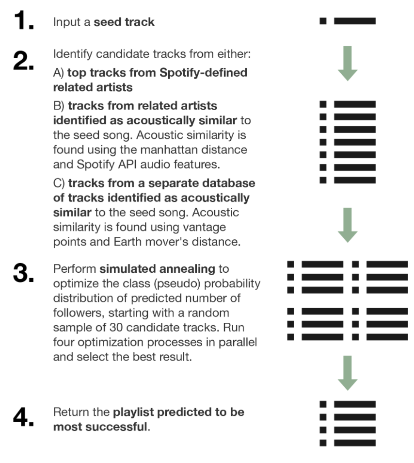

## Here is the Demo for the Playlist Generation

Here we will explain how we can build the algorithm based on the generative model we developed. Here we can include pictures as well:

<h2>My First JavaScript</h2>

<button type="button" onclick=test()>
Click me to display Date and Time
</button>

</body>
</html> 
