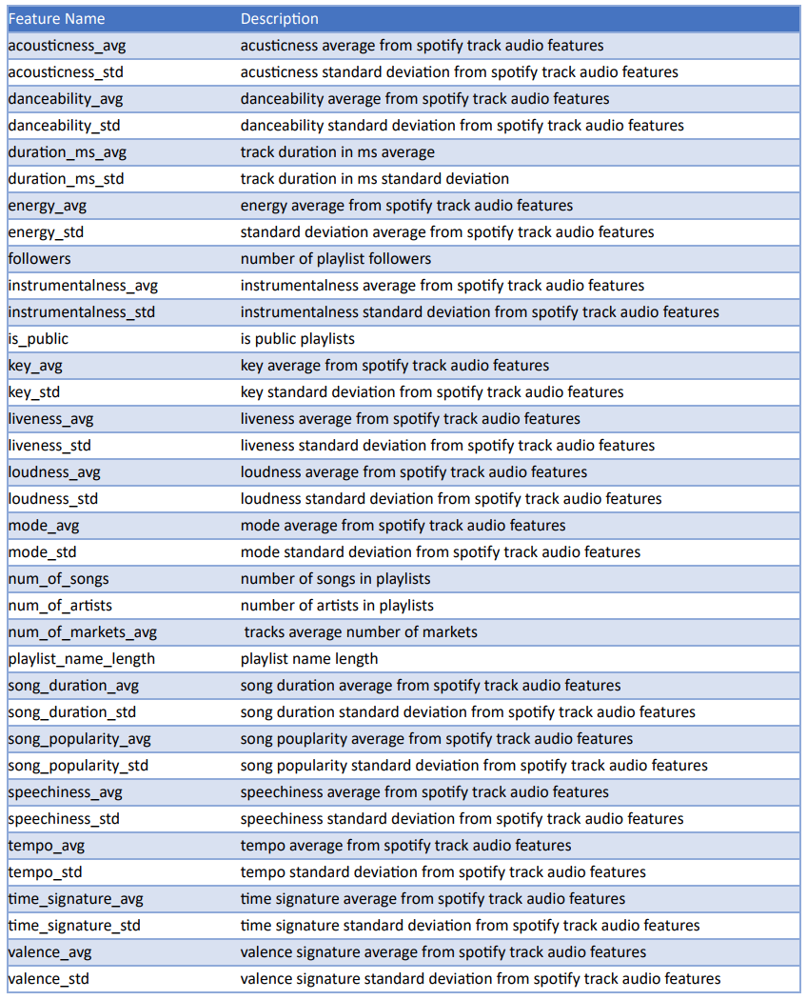

This is the home page

## Motivation

Music curators are people have the skillset to predict successful musicians as they understand about music characteristic and people taste for music. Streaming services like spotify have created a new way for people to listen music on demand and a new way to quantify the music
taste of its users. Spotify common currency is playlists, a playlist represents an aggrupation of music tracks. Users can create them from a database with billions of songs making it representation of user preferences. In this project we aim to understand what makes a playlist
successful based on data that is available in the spotify web api and the million-song database.

In this project we want to quantify playlist success by the number of followers a playlist can attract.

## Data Description

The data available from the Spotify web API is very rich. The information at playlist level includes information on the availability of the playlists to users and user demand (followers). The track data model includes data that quantifies values from audio features, artist information, and user demand. A description of the features used from this api is included in the next page. One of the limitations of this API is the lack of exploratory functions, more than one billion playlists are available however these might not seen by average users. Similar to a web search in google, users might only see the first couple pages of search results. it might be a bit difficult to a good random set of playlists as all playlists in the search will be associated with the word used in the query. ( it’s likely that the number of followers can be biased by how findable is a playlist when doing a search ). Exploring user playlists is also not very open, the API requires
you to know a user name to get playlists from that user name but a user name is considered private so the ways to get them are limited, this is understandable as playlists can be considered user private data.

## Data Model Description

|   |   |   |   |   |
|---|---|---|---|---|
|   |   |   |   |   |
|   |   |   |   |   |
|   |   |   |   |   |

<!-- >here is a quote

Here is *emph* and **bold**.

Here is some inline math $\alpha = \frac{\beta}{\gamma}$ and, of-course, E rules:

$$ G_{\mu\nu} + \Lambda g_{\mu\nu}  = 8 \pi T_{\mu\nu} . $$ -->
